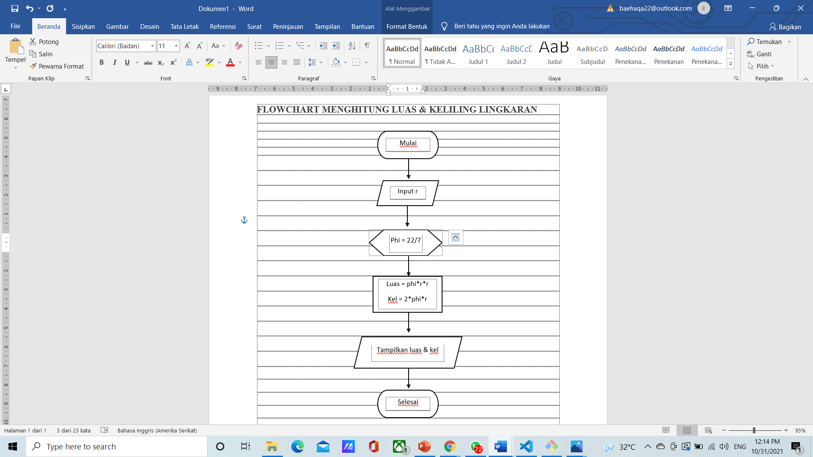
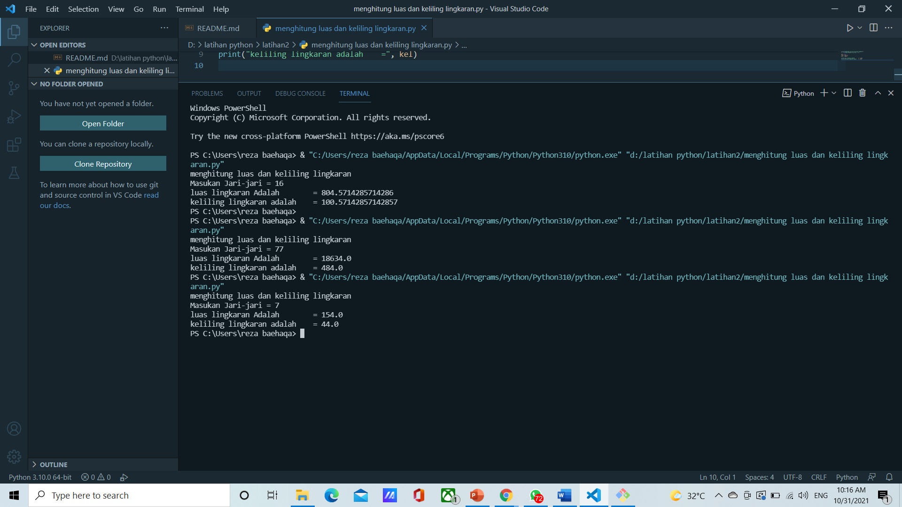

# latihan2
## Menghitung luas dan keliling lingkaran menggunakan bahasa python
untuk dapat membuat program tersebut kita buat algoritma atau langkah-langkahnya sebagai berikut :
1. mulai
2. input r
3. proses masukan phi 22/7
4. hitung luas = phi * r * r
   hitung keliling = 2 * phi * r
5. tampilkan luas dan keliling lingkaran
6. selesai

untuk lebih jelasnya kita lihat gambar flowchartnya di bawah ini

ini adalah contoh hasil dari tampilan meghitung luas dan keliling lingkaran

